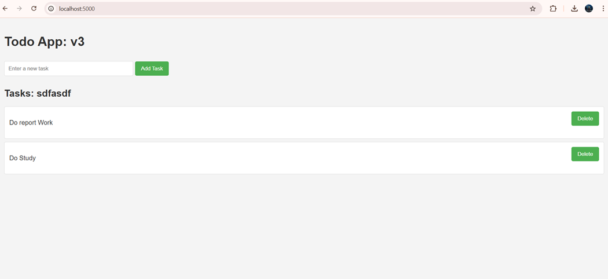

# 🚀 CI/CD Pipeline for Flask App using Jenkins, Docker & Minikube

This project demonstrates a fully automated CI/CD pipeline for a Python Flask application using Jenkins, Docker, and Kubernetes (Minikube). The goal is to automate testing, containerization, pushing to DockerHub, and deploying to Kubernetes.

---

## 📌 Features

* Install Python dependencies
* Run unit tests using PyTest
* Build and push Docker image to DockerHub
* Verify Kubernetes manifests
* Deploy app to Minikube
* Expose the app on localhost

---

## 🧰 Tools & Technologies

* **Jenkins** – CI/CD automation
* **Docker** – Container platform
* **DockerHub** – Image registry
* **Kubernetes (Minikube)** – Local container orchestration
* **Python & PyTest** – Application and testing stack

---

## 🚀 How to Run This Project

1. Install Jenkins, Docker, Minikube, and kubectl.
2. Create DockerHub credentials in Jenkins (ID: `DockerHubCreds`).
3. Connect your Jenkins pipeline to this repo.
4. Trigger the pipeline from Jenkins.
5. Access your app at `http://localhost:5000` after port forwarding.

---
## Results

---
## 📄 Certificate of Completion

✅ I have successfully completed this project.
🔗 [View Certificate Here](https://qr.me-qr.com/mobile/pdf/cea6ad4e-13a9-4d18-b7c6-700b5bd8afee) <!-- Replace with actual URL -->

---

**Happy DevOpsing!** 🚀

📌 Project Title: CI/CD Pipeline for Automated Deployment with Kubernetes & Docker
✅ Description: Designed and implemented a CI/CD pipeline using Jenkins, Docker, and Kubernetes to automate application deployment. The pipeline includes automated builds, testing, containerization, and deployment to a Kubernetes cluster, reducing deployment errors and improving release efficiency.
🛠 Tech Stack: Jenkins, Docker, Kubernetes, Minikube, GitHub, PyTest

🔹 Key Features:

Implemented CI/CD pipeline with Jenkins & GitHub for automated deployment
Built and pushed Docker images to DockerHub, ensuring consistent builds
Used Minikube for local Kubernetes cluster setup and deployment
Deployed application using kubectl apply (YAML configurations for Deployment & Service)
Verified deployment with kubectl get pods & kubectl get svc
Implemented unit testing with PyTest to maintain code quality
